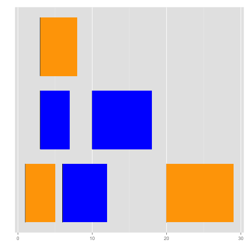
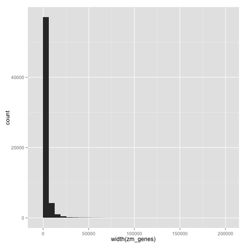
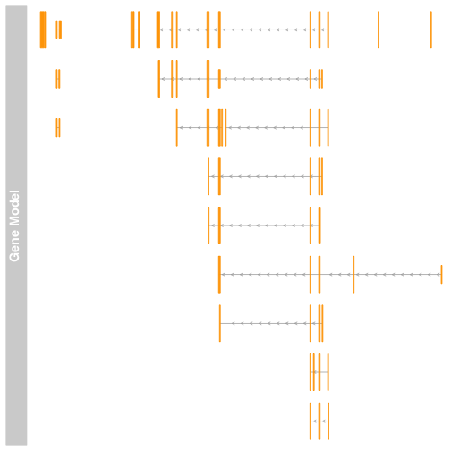

# An Introduction to Bioconductor's Packages for Working with Range Data

**Bioconductor** is an open source software project that develops and accepts
user-contributed R packages for bioinformatics. We're going to cover how to use
some Bioconductor packages to work with **range data** in R.

## Installation of Necessary Packages

Before we get started, make sure you have R 3.0.3 installed. Then, we'll need
to install some Bioconductor packages:

    source("http://bioconductor.org/biocLite.R")
    biocLite("GenomicRanges")
    biocLite("GenomicFeatures")
    install.packages("devtools")
    library(devtools)
    install_github('TxDb.Zmays.Ensembl.AGPv2.17', 'vsbuffalo')

When learning computing, I can't stand when something is presented without much
explanation, so we'll cover what this is doing. On a first read, you can skip
this.

If you've used R before, you've probably installed packages from CRAN, which is
a repository for general R packages. Above, we install packages three different
ways: from CRAN, from Bioconductor, and from Github.

First, Bioconductor packages can be installed by running
`source("http://bioconductor.org/biocLite.R")`, which loads an installation
script. Then you can run `biocLite("packagename")` where `"packagename"` is the
package you want to install. This is how we install `GenomicRanges` and
`GenomicFeatures` from Bioconductor.

Then, we install the package `devtools`. We need `devtools` because we it
includes a function for installing packages from Github. I've written and
hosted an R package called `TxDb.Zmays.Ensembl.AGPv2.17` on Github, which we
need for this presentation.

## Goals

- See why ranges are so important in bioinformatics.
- Learn why we should use specialized data structures and libraries to work
  with range data.
- Learn some basic functionality with `GenomicRanges` and `GenomicFeatures`.
- Become convinced that we should learn and use `GenomicRanges` more.

## Range Data

What is **range data** and why do we use it?

Ranges can be thought of as an interger interval on a linear sequence. It turns
out that there is a ton of bioinformatics data represented this way. For
example:

- transcription factor binding sites
- transposon sites
- transcript regions, including exons, introns, etc.
- SNPs and structural variations

This is an incomplete list; technically **any data point** on a genome can be
stored range data.

Additionally, merely storing range data isn't sufficient for the types of
analysis we wish to do with these data. We usually want to ask questions like:

- how many transcription factor binding sites fall within 10kb of our genes of interest?
- how many transposon sites interrupt known gene regions?
- what's the average nucleotide diversity of all exons, compared to introns?
- how man SNPs fall into non-coding regions?

All of these questions can be answered (actually surprisingly easily) using
**operations** on ranges.

Bioconductor's `GenomicRanges` package (and it's automatically installed sister
package `IRanges`) provide classes in R for storing range data and doing range
operations. Even better, these libraries are masterfully written, with the
low-level data functions and operations all being implemented in C (which is a
very fast language). Thus, we can load and work range data **interactively** in
memory very quickly, while using a higher-level language like R.

## IRanges Objects

Genomic ranges can built on generic range data on linear chromosomes.
Appropriately, `GenomicRanges` extends a generic package called `IRanges`,
which stores ranges on any generic linear sequence (not necessarily a
chromosome). We start with `IRanges`, and then build up from there. The range
operations implemented in `GenomicRanges` are actually built up from range
operations on these generic range objects.

## Creating IRanges Objects

We create `IRanges` objects with the `IRanges` function. We can specify the
start and end positions:


```r
library(GenomicRanges)
```

```
## Loading required package: BiocGenerics
## Loading required package: parallel
## 
## Attaching package: 'BiocGenerics'
## 
## The following objects are masked from 'package:parallel':
## 
##     clusterApply, clusterApplyLB, clusterCall, clusterEvalQ,
##     clusterExport, clusterMap, parApply, parCapply, parLapply,
##     parLapplyLB, parRapply, parSapply, parSapplyLB
## 
## The following object is masked from 'package:stats':
## 
##     xtabs
## 
## The following objects are masked from 'package:base':
## 
##     anyDuplicated, append, as.data.frame, as.vector, cbind,
##     colnames, duplicated, eval, evalq, Filter, Find, get,
##     intersect, is.unsorted, lapply, Map, mapply, match, mget,
##     order, paste, pmax, pmax.int, pmin, pmin.int, Position, rank,
##     rbind, Reduce, rep.int, rownames, sapply, setdiff, sort,
##     table, tapply, union, unique, unlist
## 
## Loading required package: IRanges
## Loading required package: XVector
```

```r
i1 <- IRanges(start = c(3, 6, 10), end = c(7, 12, 18))
i2 <- IRanges(start = c(1, 3, 20), end = c(5, 8, 29))
```


These look like:


```
## Loading required package: ggplot2
## Need specific help about ggbio? try mailing 
##  the maintainer or visit http://tengfei.github.com/ggbio/
## 
## Attaching package: 'ggbio'
## 
## The following objects are masked from 'package:ggplot2':
## 
##     geom_bar, geom_rect, geom_segment, ggsave, stat_bin,
##     stat_identity, xlim
```

 


We could also create ranges by specifying the width and start (or end)
position. For example, SNPs have a width of 1, so we might create them with:


```r
snps <- IRanges(start = c(3, 4, 1, 6, 7), width = 1)
```


Of course, this is quite tedious; later we'll see how to load data like BED
files or create data from tab-delimited data.

## Accessing Data in Ranges

We can access range data through *accessor* functions. For start, end, and
width of `IRanges` objects we use `start`, `end`, and `width` functions:


```r
start(i1)
```

```
## [1]  3  6 10
```

```r
end(i1)
```

```
## [1]  7 12 18
```

```r
width(i2)
```

```
## [1]  5  6 10
```


## Basic Range Operations

We can find overlaps between `IRanges` objects with the `findOverlaps` function.
This function returns a matrix of matches in either, which will make more sense in a second.


```r
hits <- findOverlaps(i1, i2)
hits
```

```
## Hits of length 3
## queryLength: 3
## subjectLength: 3
##   queryHits subjectHits 
##    <integer>   <integer> 
##  1         1           1 
##  2         1           2 
##  3         2           2
```


`findOverlaps` returns a matrix with what range in the *query* matches overlaps a range in the *subject*. As with many 
Bioconductor objects, we use accessor functions to access these data. For example, we can see how wide ranges in overlapping *subjects* are with:


```r
width(i2[subjectHits(hits)])
```

```
## [1] 5 6 6
```


This is a good example of how `findOverlaps` works. Since the first range in `i1` overlaps both the first and second ranges in `i2`, *both* are reported. 

We can also count the overlaps that a *query* has in a *subject* with the function `countOverlaps`:


```r
countOverlaps(i1, i2)
```

```
## [1] 2 1 0
```


### Finding IRanges Objects

Often in biology, we need to find the gene *nearest* to a specific site (represented as a range), or find the nearest range that precedes another range. IRanges has numerous functions to make these types of operations easy (see the manual for a full list). Let's see a few:


```r
i2
```

```
## IRanges of length 3
##     start end width
## [1]     1   5     5
## [2]     3   8     6
## [3]    20  29    10
```

```r
nearest(IRanges(start = 30, width = 1), i2)
```

```
## [1] 3
```


```r
precede(IRanges(start = 30, width = 1), i2)
```

```
## [1] NA
```

```r
precede(IRanges(start = 5, width = 1), i2)
```

```
## [1] 3
```


Note that *precede* does not allow for preceding ranges to overlap!

## Genomic Ranges

Ranges on a genome are built from `IRanges`. `GenomicRanges` offer important features needed to identify a region on a genome through its `GRanges` object:

1. Chromosome (called `seqname` in R, to allow for non-chromosomal sequences like scaffolds).
2. Strand

Additionally, `GRanges` object can optionally carry information such as the length of chromosomes in the genome and whether chromosomes are circular (e.g. in the case of mitocondrial and chloroplast chromsomes).

Finally, the best feature of `GRanges` is that it stores *metadata*. This is the most powerful feature of `GRanges`. Ranges alone are boring — they just tell you the "where" but not the "what", which is what we carry about in bioinformatics and biology.

Metadata in `GRanges` is how we annotate a specific region with the data on that region. For example, these data may be:

- Gene name, transcript name, gene ID, transcript ID, splicing information.
- GC content, nucleotide diversity. 
- SNP quality, genotypes of individuals.

Metadata is stored in a `DataFrame`. Bioconductor's `DataFrame` work exactly like R's `data.frame`, except they allow for more efficient storage of genomic data. `DataFrames` do this through a trick called *run length encoding*, in which long runs of data such as chromosome 1, chromosome 1, ..., chromosome 1, chromosome 2 are stored as 145,024 chromosome 1s, 358,502 chromosome 2s, etc. We won't go into the specifics here, but this is a term you'll see working with `GenomicRanges` and a concept you'll have to familiarize yourself with eventually.

### Creating and Using Genomic Ranges objects

We create `GRanges` objects just as we created `IRanges` objects, except with additional information:


```r
gr1 <- GRanges(seqnames = "chr1", IRanges(start = 356, 390), strand = "+", data_id = "some data")
gr2 <- GRanges(seqnames = "chr1", IRanges(start = 3793, 4005), strand = "+", 
    data_id = "more data")
gr1
```

```
## GRanges with 1 range and 1 metadata column:
##       seqnames     ranges strand |     data_id
##          <Rle>  <IRanges>  <Rle> | <character>
##   [1]     chr1 [356, 390]      + |   some data
##   ---
##   seqlengths:
##    chr1
##      NA
```

```r
gr2
```

```
## GRanges with 1 range and 1 metadata column:
##       seqnames       ranges strand |     data_id
##          <Rle>    <IRanges>  <Rle> | <character>
##   [1]     chr1 [3793, 4005]      + |   more data
##   ---
##   seqlengths:
##    chr1
##      NA
```


Each of these range objects stores a single region, and single column (named `data_id`) of metadata.

As with `IRanges` objects, the accessors `start`, `end`, and `width` work, as well as some new ones: `seqnames`, `strand`, and `mcols`. `mcols` returns the `DataFrame` of metadata, and is using quite frequently:


```r
mcols(gr1)
```

```
## DataFrame with 1 row and 1 column
##       data_id
##   <character>
## 1   some data
```


The `GenomicRanges` package *overloads* many of the common functions in R like `c` to work with `GRanges` data. For example, we combine `GRanges` objects with:


```r
gr <- c(gr1, gr2)
gr
```

```
## GRanges with 2 ranges and 1 metadata column:
##       seqnames       ranges strand |     data_id
##          <Rle>    <IRanges>  <Rle> | <character>
##   [1]     chr1 [ 356,  390]      + |   some data
##   [2]     chr1 [3793, 4005]      + |   more data
##   ---
##   seqlengths:
##    chr1
##      NA
```


You'll see that R is doing a pretty nice job of printing these data. Note that `seqlengths` is `NA`, since we haven't specified the sequence (e.g. chromsome lengths). We could through, with:


```r
seqlengths(gr) <- c(chr1 = 12951230)
```


Note that our old friends `findOverlaps` and `countOverlaps` work too. Bioconductor has very advanced features for computing overlaps, given how incredibly important these are in bioinformatics tasks like ChIP-Seq, RNA-seq, etc. We won't introduce these here, but the `GenomicRanges` vignette and manual are terrific.

### Lists

R uses lists extensively for two many purposes:

1. To store heterogenous data types (recall that all elements in a vector will be coerced to a common type)
2. To group data a certain way. 

Number (2) is especially relevant to using an object called `GRangesList` that we haven't encountered yet. Consider tasks like grouping `GRanges` objects by transcript or gene ID. We want a collection of many *separate* `GRanges` objects. This is where `GRangesList` comes in handy. We'll see an example of these object in the next section.

### Genomic Features

These data so far aren't real, or exciting. As a final motivating example, I will show you a package I wrote using a sister package of `GenomicRages`: `GenomicFeatures`. These help in creating and working with `GRanges` objects storing transcript annotation.

Let's play around with the package a bit. First, we load the package, and to avoid typing out this long name (the name follows a Bioconductor standard naming scheme), we alias it to `txdb`:


```r
library(TxDb.Zmays.Ensembl.AGPv2.17)
```

```
## Loading required package: GenomicFeatures
## Loading required package: AnnotationDbi
## Loading required package: Biobase
## Welcome to Bioconductor
## 
##     Vignettes contain introductory material; view with
##     'browseVignettes()'. To cite Bioconductor, see
##     'citation("Biobase")', and for packages 'citation("pkgname")'.
```

```r
txdb <- TxDb.Zmays.Ensembl.AGPv2.17
txdb
```

```
## TranscriptDb object:
## | Db type: TranscriptDb
## | Supporting package: GenomicFeatures
## | Data source: ftp://ftp.ensemblgenomes.org/pub/plants/release-17/gtf/zea_mays/Zea_mays.AGPv2.17.gtf.gz
## | Organism: Zea mays
## | miRBase build ID: NA
## | transcript_nrow: 88611
## | exon_nrow: 280561
## | cds_nrow: 251121
## | Db created by: GenomicFeatures package from Bioconductor
## | Creation time: 2014-03-18 15:13:03 -0700 (Tue, 18 Mar 2014)
## | GenomicFeatures version at creation time: 1.14.5
## | RSQLite version at creation time: 0.11.4
## | DBSCHEMAVERSION: 1.0
```


`txdb` is an object that's a link to a SQLite database full of maize annotation from Ensembl. Again, we work with accessor functions to extract data from it. For example, we can extract all genes as `GRanges` objects with:


```r
zm_genes <- genes(txdb)
```


Let's play around with this `GRanges` object to see some real examples. For example, how many genes are there?


```r
length(zm_genes)
```

```
## [1] 63331
```


This is a lot of genes! This because this is the whole gene set from Ensembl (which, as far as I can tell, doesn't have a column indicating filtered status). My package also contains the filtered gene set, `TxDb.Zmays.EnsemblFiltered.AGPv2.17`. 

These are genic regions. With these data, we could create a histogram of all gene lengths:


```r
qplot(width(zm_genes), geom = "histogram")
```

```
## stat_bin: binwidth defaulted to range/30. Use 'binwidth = x' to adjust this.
```

 


We could also look at summary statistics on length:


```r
summary(width(zm_genes))
```

```
##    Min. 1st Qu.  Median    Mean 3rd Qu.    Max. 
##      76     665    1560    3040    3500  192000
```


With these data, we could use very generic range operations to create new interesting ranges. There also functions to grab the promoter regions, given a certain number of upstream and downstream bases. These can be applied to ranges or `txdb` objects:


```r
promoters(txdb, upstream = 4000)
```

```
## Warning: trimmed start values to be positive
## Warning: trimmed end values to be <= seqlengths
```

```
## GRanges with 88611 ranges and 2 metadata columns:
##                seqnames           ranges strand   |     tx_id
##                   <Rle>        <IRanges>  <Rle>   | <integer>
##       [1]             1 [  5856,  10055]      +   |     75031
##       [2]             1 [ 58502,  62701]      +   |     75032
##       [3]             1 [ 58734,  62933]      +   |     75033
##       [4]             1 [ 72120,  76319]      +   |     75034
##       [5]             1 [106765, 110964]      +   |     75035
##       ...           ...              ...    ... ...       ...
##   [88607] mitochondrion [502097, 506296]      -   |       212
##   [88608] mitochondrion [504276, 508475]      -   |       213
##   [88609] mitochondrion [510067, 514266]      -   |       214
##   [88610] mitochondrion [548496, 552695]      -   |       215
##   [88611] mitochondrion [564318, 568517]      -   |       216
##                     tx_name
##                 <character>
##       [1] GRMZM2G059856_T01
##       [2] GRMZM5G811273_T02
##       [3] GRMZM5G811273_T01
##       [4] GRMZM2G059778_T01
##       [5] GRMZM2G394757_T01
##       ...               ...
##   [88607] GRMZM5G847102_T01
##   [88608] GRMZM5G899452_T01
##   [88609] GRMZM5G887911_T01
##   [88610] GRMZM5G880315_T01
##   [88611] GRMZM5G872234_T01
##   ---
##   seqlengths:
##      chloroplast mitochondrion       UNKNOWN ...             4             1
##           140384        569630       7140151 ...     241473504     301354135
```


There are also methods in Bioconductor packages to extract sequence from these regions. Depending on the exact task, I may do this through the shell with [bedtools](https://github.com/arq5x/bedtools2).

Gene ranges are a bit low resolution — suppose we want to look at all exons:


```r
zm_exons <- exons(txdb)
zm_exons
```

```
## GRanges with 280561 ranges and 1 metadata column:
##                 seqnames           ranges strand   |   exon_id
##                    <Rle>        <IRanges>  <Rle>   | <integer>
##        [1]             1   [ 9856, 10388]      +   |    237421
##        [2]             1   [62502, 62504]      +   |    237422
##        [3]             1   [62572, 62710]      +   |    237423
##        [4]             1   [62734, 62958]      +   |    237424
##        [5]             1   [63296, 63402]      +   |    237425
##        ...           ...              ...    ... ...       ...
##   [280557] mitochondrion [501949, 502296]      -   |       258
##   [280558] mitochondrion [504158, 504475]      -   |       259
##   [280559] mitochondrion [509973, 510266]      -   |       260
##   [280560] mitochondrion [548031, 548695]      -   |       261
##   [280561] mitochondrion [564155, 564517]      -   |       262
##   ---
##   seqlengths:
##      chloroplast mitochondrion       UNKNOWN ...             4             1
##           140384        569630       7140151 ...     241473504     301354135
```


This object is all exons, without very much other data. We can group exons or transcripts by gene (or transcript) ID using functions `exonsBy` or `transcriptsBy`:


```r
zm_exons_tx <- exonsBy(txdb, "tx")
zm_exons_tx
```

```
## GRangesList of length 88611:
## $1 
## GRanges with 1 range and 3 metadata columns:
##          seqnames        ranges strand |   exon_id   exon_name exon_rank
##             <Rle>     <IRanges>  <Rle> | <integer> <character> <integer>
##   [1] chloroplast [6392, 12986]      + |         1        <NA>         1
## 
## $2 
## GRanges with 1 range and 3 metadata columns:
##          seqnames         ranges strand | exon_id exon_name exon_rank
##   [1] chloroplast [21468, 24695]      + |       2      <NA>         1
## 
## $3 
## GRanges with 1 range and 3 metadata columns:
##          seqnames         ranges strand | exon_id exon_name exon_rank
##   [1] chloroplast [24733, 26784]      + |       3      <NA>         1
## 
## ...
## <88608 more elements>
## ---
## seqlengths:
##    chloroplast mitochondrion       UNKNOWN ...             4             1
##         140384        569630       7140151 ...     241473504     301354135
```


With these grouped exons, we may want to ask which fall in a particular range. Again, Bioconductor makes this a fairly high-level operation by writing methods that work with many different types of objects (such as `GRangesList`). So to get all genes on chromosome 7 on either strand, starting from 104,203,103 and include 10Mbp:


```r
query <- GRanges("7", IRanges(start = 104203103, width = 1e+07), strand = "*")
findOverlaps(query, zm_exons_tx)
```

```
## Hits of length 261
## queryLength: 1
## subjectLength: 88611
##     queryHits subjectHits 
##      <integer>   <integer> 
##  1           1       29874 
##  2           1       29875 
##  3           1       29876 
##  4           1       29877 
##  5           1       29878 
##  ...       ...         ... 
##  257         1       33515 
##  258         1       33516 
##  259         1       33517 
##  260         1       33518 
##  261         1       33519
```


## Other Bioconductor Packages

`GenomicRanges` and `GenomicFeatures` are scratching the surface of Bioconductor's great packages. Other useful packages are:

 - Annotation packages, which store mappings of gene IDs to names, GO terms, etc.
 - `RSamtools` for working with BAM files. There are special classes for working with and visualizing alignments.
 - Genome packages, which compress genomes and allow them to be used in R.
 - Terrific visualization packages like `ggbio` and `Gviz`.


```r
library(Gviz)
```

```
## Loading required package: grid
```

```r
data(geneModels)
grtrack <- GeneRegionTrack(geneModels, genome = "hg19", chromosome = "chr7", 
    name = "Gene Model")
plotTracks(grtrack)
```

 


I've done this example data, because I'm still working out some issues with Ensembl gene annotation (grrr!).
 
## Conclusion and Resources

This is a very fast introduction! If you aren't a bit confused, it's either because you've left the room or you've fallen asleep. 

My goal here was not to be comphrensive (there's certainly not enough time for that), but rather to show you why we should use these tools, how they are helpful, and introduce enough of the infrastructure that you won't have to start from zero.

The best place to start is the `GenomicRanges` [introduction](http://www.bioconductor.org/packages/release/bioc/vignettes/GenomicRanges/inst/doc/GenomicRangesIntroduction.pdf).

The `GenomicRanges` [How To](http://www.bioconductor.org/packages/release/bioc/vignettes/GenomicRanges/inst/doc/GenomicRangesHOWTOs.pdf) is quite good too.

There's always a tradeoff between three things in bioinformatics: computational speed, interactivity, and development time. We like computational speed to be fast, and development time to be low. Interactivity makes development, debugging, and figuring out what we're doing easier. There are likely faster custom solutions to `GenomicRanges`. But these sacrifice the incredible interactivity of `GenomicRanges` and fast development time. Given how high interactivity and low development time is for working with `GenomicRanges`, it's speed (quite fast!) is incredible.
